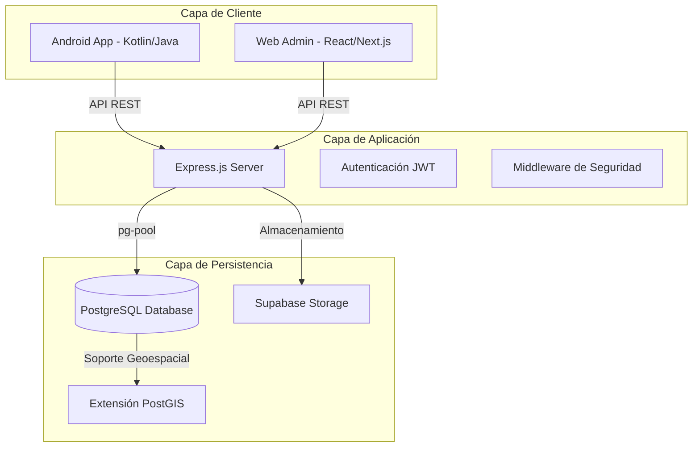
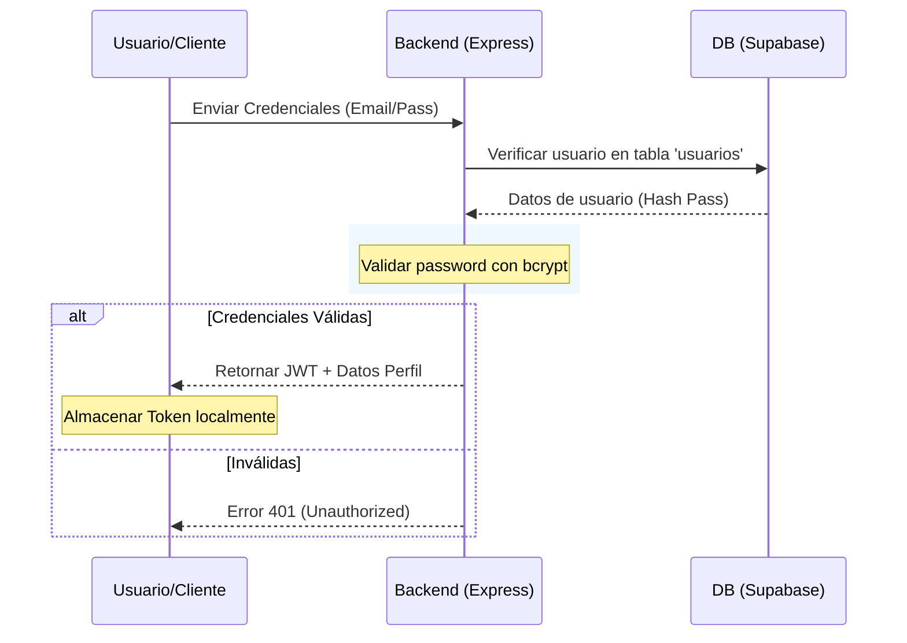

# Documentación Técnica UML - Proyecto Trekking (TrekkColombia)

Este documento proporciona una visión detallada de la arquitectura, el flujo de datos y la estructura del sistema **TrekkColombia** utilizando diagramas UML estandarizados.

---

## 1. Arquitectura del Sistema (Diagrama de Componentes)

El sistema sigue una arquitectura de n-capas desacopladas, lo que permite la escalabilidad de cada componente de forma independiente.



---

## 2. Modelo de Datos (Diagrama Entidad-Relación)

Este diagrama detalla la estructura relacional de la base de datos y cómo PostGIS se integra para el manejo de rutas geográficas.

```mermaid
erDiagram
    USUARIO ||--o{ FAVORITO : "posee"
    RUTA ||--o{ FAVORITO : "es_marcada"
    EMPRESA ||--o{ RUTA : "publica"
    EMPRESA ||--o{ GUIA : "contrata"
    RUTA }o--|| GUIA : "es_liderada"

    USUARIO {
        int idusuario PK
        string nombre
        string correo UNIQUE
        string password
        string rol "admin/user"
        timestamp fecha_creacion
    }

    RUTA {
        int id PK
        string title
        string description
        string difficulty "Baja/Media/Alta"
        string duration
        geometry geom "LINESTRING PostGIS"
        float latitude
        float longitude
        int id_empresa FK
    }

    EMPRESA {
        int id PK
        string nombre
        bigint identificacion
    }

    GUIA {
        int id PK
        string nombre
        string telefono
        int id_empresa FK
    }

    FAVORITO {
        int idusuario FK
        int idruta FK
    }
```

---

## 3. Casos de Uso (Diagrama de Casos de Uso)

Representa las interacciones de los diferentes actores con el sistema.

```mermaid
useCaseDiagram
    actor Usuario as "Usuario Final"
    actor Admin as "Administrador"
    actor Sistema as "Sistema Supabase"

    package "Trekking App" {
        usecase UC1 as "Explorar Rutas"
        usecase UC2 as "Gestionar Favoritos"
        usecase UC3 as "Iniciar Sesión"
        usecase UC4 as "Cargar Archivos GPX"
        usecase UC5 as "Gestionar Empresas/Guías"
    }

    Usuario --> UC1
    Usuario --> UC2
    Usuario --> UC3
    Admin --> UC3
    Admin --> UC4
    Admin --> UC5
    UC4 --> Sistema
```
> [!NOTE]
> El Administrador tiene permisos extendidos para la gestión de activos geográficos (GPX) y entidades comerciales (Empresas).

---

## 4. Flujo de Autenticación (Diagrama de Secuencia)

Detalla el proceso de login y autorización mediante tokens JWT.



---

## 5. Resumen Tecnológico

| Componente | Tecnología |
| :--- | :--- |
| **Base de Datos** | PostgreSQL (v15+) |
| **Extensiones** | PostGIS (Geolocalización) |
| **Servidor** | Node.js / Express |
| **Auth** | JWT / bcrypt |
| **Infraestructura** | Supabase Project |

> [!TIP]
> Para visualizar estos diagramas correctamente, puedes utilizar extensiones de **Marmaid** en VS Code o copiar el código en el editor online de [Mermaid Live](https://mermaid.live/).
