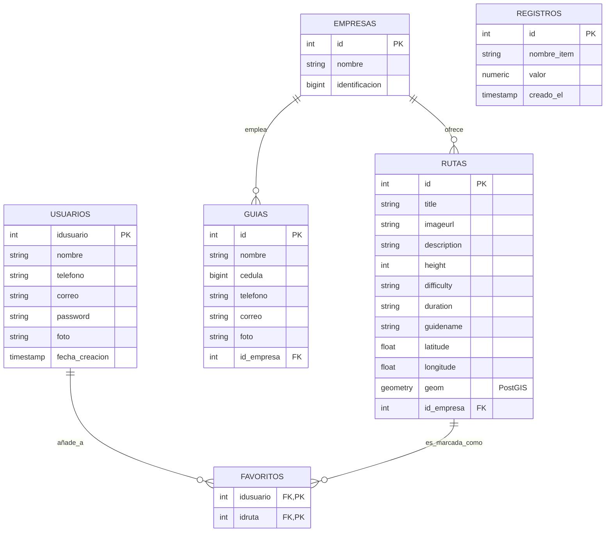

# Diagramas UML y Arquitectura del Proyecto Trekking

Este documento detalla la estructura principal de la base de datos y la arquitectura técnica del proyecto **Trekking (TrekkColombia)** utilizando diagramas UML generados con Mermaid.

## 1. Diagrama de Entidad-Relación (Modelo de Datos)

Este diagrama representa la estructura de las tablas en la base de datos de PostgreSQL (Supabase) y cómo se relacionan entre sí.



### Relaciones principales:
*   **Empresas -> Rutas**: Una empresa puede ofrecer múltiples rutas.
*   **Empresas -> Guías**: Una empresa puede tener varios guías registrados.
*   **Usuarios -> Favoritos**: Un usuario puede guardar múltiples rutas como favoritas.
*   **Rutas -> Favoritos**: Una ruta puede ser añadida a favoritos por varios usuarios (relación muchos a muchos mediante la tabla `favoritos`).

---

## 2. Diagrama de Arquitectura del Sistema

El proyecto "Trekking" está compuesto por tres capas principales: los clientes (Móvil y Web), el servidor intermediario (Backend) y el almacenamiento de datos (Supabase).

```mermaid
graph TD
    subgraph Capa de Presentación (Clientes)
        A[App Móvil Android<br/>ruta-app-android]
        B[Frontend Web<br/>ruta-app-frontend]
    end

    subgraph Capa Lógica (Servidor)
        C[Node.js + Express Backend<br/>ruta-app-backend]
    end

    subgraph Capa de Datos
        D[(Supabase PostgreSQL<br/>+ PostGIS)]
    end

    A -- REST API / JSON --> C
    B -- REST API / JSON --> C
    C -- Consultas SQL / pg --> D
```

### Descripción de las Capas:
1.  **Clientes (Android & Web)**: Son las interfaces con las que interactúa el usuario final. Muestran las rutas, mapas, inicio de sesión y gestión de favoritos.
2.  **Backend (Node.js)**: Centraliza la lógica de negocio. Recibe las peticiones de los clientes, procesa la autenticación usando JWT, y se encarga de formatear y proteger las solicitudes hacia la base de datos.
3.  **Supabase**: Administra la persistencia de datos relacionales y el soporte espacial mediante la extensión **PostGIS** para mapear las coordenadas geográficas de las rutas.
